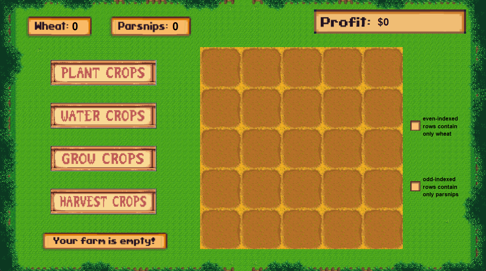

# 👩‍🌾 Farm Simulation (JUnit Testing Assignment)

## ℹ️ Overview
This project is an assignment for the CS121: Introduction to Computer Science course.  

Students are given a plot of farmland where they can plant, water, grow, and harvest their crops. The goal of this assignment is for students to create JUnit tests utilizing assertion statements that check whether various features of their farm simulation run as expected.

> **Note:** This project was developed through a university program that creates assignments for introductory computer science courses. Solution code is not included in accordance with the university's academic integrity policy. Students will be writing their code in ```FarmTest.java``` in areas where a ```// WRITE YOUR CODE HERE``` comment is present.

## 🎮 Features
* Plant different crops on the farm
    * Three consecutive input fields will pop up and ask for the:
       * Crop name ("wheat" or "parsnip")
       * Row-index to plant on (ranges from 0-4)
       * Quantity of crops to plant
* Water the whole farm
* Grow crops that have been planted and watered
* Harvest ripe crops and earn profit:
   * **$6** per wheat
   * **$3** per parsnip
* A Stardew-Valley-inspired GUI written in Swing (```Driver.java```)
    * A 5x5 farm grid that displays the state of each farm tile
    * Buttons to run specific farm operations
    * A sign appearing when the farm is empty
    * Checkboxes indicating when each row contains only the appropriate crop
    * Individual crop counters
    * A profit counter

## 🧪 Tests
JUnit tests are to be written in ```FarmTest.java``` under each ```// WRITE YOUR CODE HERE``` comment and replace each ```fail``` assertion. Students must test that:

### Test 1
* The ```Farm``` ADT initializes an empty farm plot  

### Test 2
* Wheat is planted on only even-indexed rows
* Parsnips are planted on only odd-indexed rows
* The number of wheat currently planted is greater than the number of parsnips planted  

### Test 3
* The expected profit from harvesting crops is equal to the actual profit earned  

## 💻 Technologies Used
* Java
* Java Swing
* JUnit 4

## 📸 Snapshots

